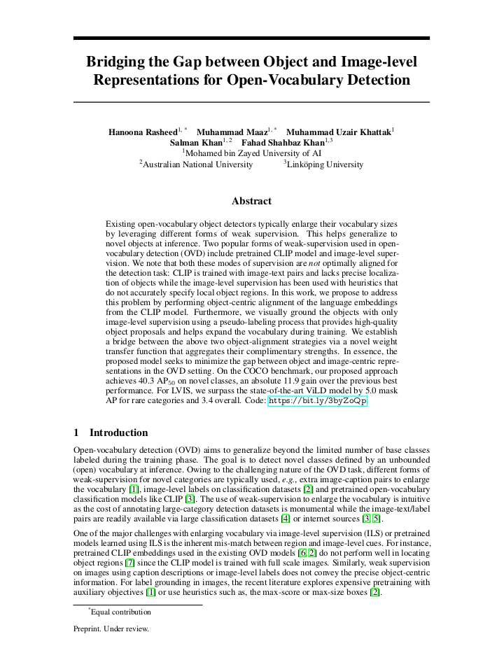
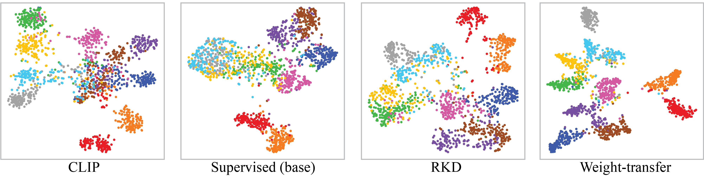
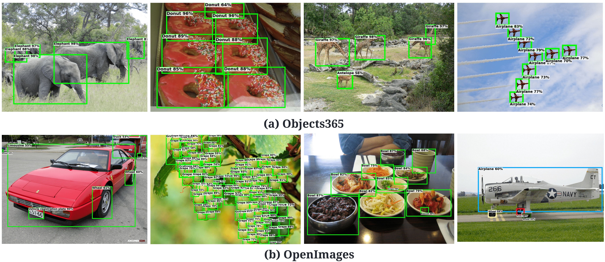

  <p align="center"> <sup>1</sup><a href="https://scholar.google.com/citations?user=yhDdEuEAAAAJ&hl=en&authuser=1&oi=sra">Hanoona Rasheed</a> <sup>1</sup><a href="https://scholar.google.com/citations?user=vTy9Te8AAAAJ&hl=en&authuser=1&oi=sra">Muhammad Maaz</a> <sup>1</sup><a href="https://scholar.google.com/citations?user=M6fFL4gAAAAJ&hl=en">Muhammad Uzair Khattak</a> </p> 
  <p align="center">
  <sup>1,2</sup><a href="https://salman-h-khan.github.io/">Salman Khan</a> <sup>1,3</sup><a href="https://scholar.google.es/citations?user=zvaeYnUAAAAJ&hl=en">Fahad Shahbaz Khan</a>
  </p> 
  

<p align="center" style="color:black;">
  <sup>1</sup>Mohamed Bin Zayed University of Artificial Intelligence <sup>2</sup>Austrailian National University  </p>
  <p align="center" style="color:black;"> 
  <sup>3</sup>linköping university </p>


<br>

&emsp;&emsp;&emsp;&emsp;&emsp;&emsp;&emsp;&emsp;&emsp;&emsp;&emsp;&emsp;&emsp;&emsp; [Paper:](https://arxiv.org/abs/2206.10589) [](https://arxiv.org/abs/2206.10589)  , [Code:](https://github.com/mmaaz60/EdgeNeXt) [](https://github.com/mmaaz60/EdgeNeXt) , [Slides:](https://drive.google.com/file/d/1t0tthvh_-dd1BvcmokEb-3FUIaEE31DD/view) [](https://drive.google.com/file/d/1t0tthvh_-dd1BvcmokEb-3FUIaEE31DD/view)

<br>

<p align="center">
<iframe width="560" height="315" src="https://www.youtube.com/watch?v=JHkuK1mjP28" title="YouTube video player" frameborder="0" allow="accelerometer; autoplay; clipboard-write; encrypted-media; gyroscope; picture-in-picture" allowfullscreen></iframe>
</p>


## Abstract


<p align="justify">
Existing open-vocabulary object detectors typically enlarge their vocabulary sizes by leveraging 
different forms of weak supervision. This helps generalize to novel objects at inference. Two popular forms of 
 weak-supervision used in open-vocabulary detection (OVD) include pretrained CLIP model and image-level supervision.
 We note that both these modes of supervision are not optimally aligned for the detection task: CLIP is trained
 with image-text pairs and lacks precise localization of objects while the image-level supervision has been used with
 heuristics that do not accurately specify local object regions. In this work, we propose to address this problem by
 performing object-centric alignment  of the language embeddings from the CLIP model. Furthermore, we visually ground
 the objects with only image-level supervision using a pseudo-labeling process that provides high-quality object 
 proposals and helps expand the vocabulary during training. We establish a bridge between the above two
 object-alignment strategies via a novel weight transfer function that aggregates their complimentary strengths.
 In essence, the proposed model seeks to minimize the gap between object and image-centric representations in the
 OVD setting. On the COCO benchmark, our proposed approach achieves 40.3 AP50 on novel classes, an absolute 11.9
 gain over the previous best performance. For LVIS, we surpass the state-of-the-art ViLD model by 5.0 mask AP for rare
 categories and 3.4 overall. </p>
 
## Model Zoo

### New LVIS Baseline
Our Mask R-CNN based LVIS Baseline ([mask_rcnn_R50FPN_CLIP_sigmoid](configs/lvis/mask_rcnn_R50FPN_CLIP_sigmoid.yaml)) 
achieves 12.2 rare class and 20.9 overall AP and trains in only 4.5 hours on 8 A100 GPUs. 
We believe this could be a good baseline to be considered for the future research work in LVIS OVD setting.

```{table} my caption
| Name                                                                                       | APr | APc | APf | AP | Epochs                                                                                                                                          |
|--------------------------------------------------------------------------------------------|------|----|---|------|------|
| [PromptDet Baseline](https://arxiv.org/pdf/2203.14940.pdf)          | 7.4 | 17.2 | 26.1 | 19.0 | 12 |
| [ViLD-text](https://arxiv.org/abs/2104.13921)           | 10.1 | 23.9 | 32.5 | 24.9 | 384 |
| [Ours Baseline](configs/lvis/mask_rcnn_R50FPN_CLIP_sigmoid.yaml)         | 12.2 | 19.4 | 26.4 | 20.9 | 12 |

```


### Open-vocabulary COCO
Effect of individual components in our method. Our weight transfer method provides complimentary gains from RKD and ILS, achieving superior results as compared to naively adding both components.

| Method                                                                                       | APnovel | APbase | AP   | Download |
|--------------------------------------------------------------------------------------------|---------|--------|------|----------|
| [Base-OVD-RCNN-C4](https://github.com/hanoonaR/object-centric-ovd/blob/main/configs/coco/Base-OVD-RCNN-C4.yaml)                                     | 1.7     | 53.2   | 39.6 | [model](https://mbzuaiac-my.sharepoint.com/:u:/g/personal/hanoona_bangalath_mbzuai_ac_ae/EVLABS0bOahDqpRFOuzYR0YBzvVU-GiC4JMTsdSxMoUG4w?e=FqvWCT)                  |
| [COCO_OVD_Base_RKD](https://github.com/hanoonaR/object-centric-ovd/blob/main/configs/coco/COCO_OVD_Base_RKD.yaml)                                   | 21.6    | 54.4   | 45.8 | [model](https://mbzuaiac-my.sharepoint.com/:u:/g/personal/hanoona_bangalath_mbzuai_ac_ae/EamR9AJ8tBdJqYMf2Cn9tm8B0MoL4hpK2cavnsr0NKDcUA?e=WxNGRB)        |
| [COCO_OVD_Base_PIS](https://github.com/hanoonaR/object-centric-ovd/blob/main/configs/coco/COCO_OVD_Base_PIS.yaml)                                   | 34.2    | 52.0   | 47.4 | [model](https://mbzuaiac-my.sharepoint.com/:u:/g/personal/hanoona_bangalath_mbzuai_ac_ae/EQSUB_pxTalIiArcEPprzaABvC5CFg2Ti8u-gA6gZlljIA?e=LEUr6i)    |
| [COCO_OVD_RKD_PIS](https://github.com/hanoonaR/object-centric-ovd/blob/main/configs/coco/COCO_OVD_RKD_PIS.yaml)                                     | 35.3    | 52.9   | 48.3 | [model]() |
| [COCO_OVD_RKD_PIS_WeightTransfer](https://github.com/hanoonaR/object-centric-ovd/blob/main/configs/coco/COCO_OVD_RKD_PIS_WeightTransfer.yaml)       | 40.3    | 54.1   | 50.5 | [model](https://mbzuaiac-my.sharepoint.com/:u:/g/personal/hanoona_bangalath_mbzuai_ac_ae/Edj5sCOJjAFPqEH3gBrCj6UBRNl6qkanZoHiUDYkTsOHlg?e=SjR5q2)            |
| [COCO_OVD_RKD_PIS_WeightTransfer_8x](https://github.com/hanoonaR/object-centric-ovd/blob/main/configs/coco/COCO_OVD_RKD_PIS_WeightTransfer_8x.yaml) | <b style="color:black;"> 40.5 </b>   |  <b style="color:black;"> 56.7 </b>   | <b style="color:black;"> 52.5 </b>  | [model](https://mbzuaiac-my.sharepoint.com/:u:/g/personal/hanoona_bangalath_mbzuai_ac_ae/EUtwrJyDAO9GsI13MpyqyJ4BssrY1JZbaUhPnmFt4FJktA?e=9RxhZF) |

### Open-vocabulary LVIS
Effect of proposed components in our method on LVIS.


| Method                                                                                       | APr | APc | APf | AP | Download                                                                                                                                          |
|--------------------------------------------------------------------------------------------|------|----|---|------|---------------------------------------------------------------------------------------------------------------------------------------------------|
| [mask_rcnn_R50FPN_CLIP_sigmoid](https://github.com/hanoonaR/object-centric-ovd/blob/main/configs/lvis/mask_rcnn_R50FPN_CLIP_sigmoid.yaml)           | 12.2 | 19.4 | 26.4 | 20.9 | [model](https://mbzuaiac-my.sharepoint.com/:u:/g/personal/hanoona_bangalath_mbzuai_ac_ae/EYtGSw6Cmt5JrrjIWV9rfdwBm_ncdhHuIjxJgE9BHv8d2g?e=kVcxb3) |
| [LVIS_OVD_Base_RKD](https://github.com/hanoonaR/object-centric-ovd/blob/main/configs/lvis/LVIS_OVD_Base_RKD.yaml)                                   | 15.2 | 20.2 | 27.3 | 22.1 | [model](https://mbzuaiac-my.sharepoint.com/:u:/g/personal/hanoona_bangalath_mbzuai_ac_ae/EXKueSpvtGNLmjvb3iLeK8UBZ_Zawjna4Uy5EmmnafwOtw?e=45Hsu6) |
| [LVIS_OVD_Base_PIS]([configs/lvis/LVIS_OVD_Base_PIS.yaml](https://github.com/hanoonaR/object-centric-ovd/blob/main/configs/lvis/LVIS_OVD_Base_PIS.yaml))                                   | 17.0 | 21.2 | 26.1 | 22.4 | [model](https://mbzuaiac-my.sharepoint.com/:u:/g/personal/hanoona_bangalath_mbzuai_ac_ae/ERr8V8v5Mp9NioxQ2GG_QnIB8SUzNN5NqfGWIXPIifgBmw?e=nls03R) |
| [LVIS_OVD_RKD_PIS](https://github.com/hanoonaR/object-centric-ovd/blob/main/configs/lvis/LVIS_OVD_RKD_PIS.yaml)                                     | 17.3 | 20.9 | 25.5 | 22.1 | [model](https://mbzuaiac-my.sharepoint.com/:u:/g/personal/hanoona_bangalath_mbzuai_ac_ae/EeLjE7LRTmdHhreI-baMncYBTGUadRF9kxHVYjC700L7Xg?e=TrI3oi) |
| [LVIS_OVD_RKD_PIS_WeightTransfer](https://github.com/hanoonaR/object-centric-ovd/blob/main/configs/lvis/LVIS_OVD_RKD_PIS_WeightTransfer.yaml)       | 17.2 | 21.5 | 26.6 | 22.8 | [model](https://mbzuaiac-my.sharepoint.com/:u:/g/personal/hanoona_bangalath_mbzuai_ac_ae/ETZ6xlqmIxlEiee7Nj1G2I8BE6iaY7ArFEAEVHohQJCamg?e=mfP1Mh) |
| [LVIS_OVD_RKD_PIS_WeightTransfer_8x]([configs/lvis/LVIS_OVD_RKD_PIS_WeightTransfer_8x.yaml](https://github.com/hanoonaR/object-centric-ovd/blob/main/configs/lvis/LVIS_OVD_RKD_PIS_WeightTransfer_8x.yaml)) | <b style="color:black;"> 21.1 </b> | <b style="color:black;"> 25.0 </b> | <b style="color:black;"> 29.1 </b>  | <b style="color:black;"> 25.9 </b> | [model](https://mbzuaiac-my.sharepoint.com/:u:/g/personal/hanoona_bangalath_mbzuai_ac_ae/EV8g8qped_FCugaB83jeW6EBHBAgWf9ajXv_TeLEGiPMtg?e=wsac5n) |

## Comparison with Existing OVOD Works

#### Open-vocabulary COCO

| Method                                                                                                                                       | APr | APc | APf  |                                                                                                                                         
|----------------------------------------------------------------------------------------------------------------------------------------------|------|----|------|
| [OVR-CNN](https://openaccess.thecvf.com/content/CVPR2021/papers/Zareian_Open-Vocabulary_Object_Detection_Using_Captions_CVPR_2021_paper.pdf) | 22.8 | 46.0 | 39.9 | 
| [ViLD†](https://arxiv.org/pdf/2104.13921.pdf)                                                                                                | 27.6 | 59.5 | 51.3 | 
| [Detic](https://arxiv.org/pdf/2201.02605.pdf)                                                                                                | 27.8 | 47.1 | 45.0 | 
| [Detic‡](https://arxiv.org/pdf/2201.02605.pdf)                                                                                               | 28.4 | 53.8 | 47.2 | 
| Ours                                                                                                                                         | <b style="color:black;"> 40.3 </b>    | <b style="color:black;"> 54.1 </b>   | <b style="color:black;"> 50.5 </b>  |
| Ours†                                                                                                                                         | 40.5    | 56.7   | 52.5 |

#### Open-vocabulary LVIS

| Method                                                                                       | APr | APc | APf | AP | Epochs                                                                                                                                          |
|--------------------------------------------------------------------------------------------|------|----|---|------|------|
| [ViLD](https://arxiv.org/pdf/2203.14940.pdf)          | 16.1 | 20.0 | 28.3 | 22.5 | 384 |
| Ours           | 17.2 | 21.5 | 26.6 | 22.8 | 36 |
| Ours         | <b style="color:black;"> 21.1 </b> | <b style="color:black;"> 25.0 </b> | <b style="color:black;"> 29.1 </b> | <b style="color:black;"> 25.9 </b> | 96 |

<br/> 

| Method                                                                                       | APr | APc | APf | AP |                                                                                                                                          
|--------------------------------------------------------------------------------------------|------|----|---|------|
| [Box-Supervised](https://arxiv.org/pdf/2201.02605.pdf)          | 16.3 | 31.0 | 35.4 | 30.0 |
| [Detic (Image + Captions)](https://arxiv.org/pdf/2201.02605.pdf)           | 24.6 | 32.5 | 35.6 | 32.4 |
| Ours         | <b style="color:black;"> 25.2 </b> |  <b style="color:black;"> 33.4 </b>  | <b style="color:black;"> 35.8 </b> | <b style="color:black;"> 32.9 </b>  |

<br/> 

## TSNE Visualizations

t-SNE plots of CLIP and our detector region embeddings on COCO novel categories.




## Region Embeddings similarity matrices

Plots of the Region Embeddings similarity matrices of COCO Novel categories by CLIP and our detector. 


## Qualitative Results (Open Vocabulary Setting)


## Qualitative Results (Cross Datasets transfer)




## BibTeX:
```
@article{Gaboardi2021,
    doi       = {10.21105/joss.02826},
    url       = {https://doi.org/10.21105/joss.02826},
    year      = {2021},
    publisher = {The Open Journal},
    volume    = {6},
    number    = {62},
    pages     = {2826},
    author    = {James D. Gaboardi and Sergio Rey and Stefanie Lumnitz},
    title     = {spaghetti: spatial network analysis in PySAL},
    journal   = {Journal of Open Source Software}
}
```
